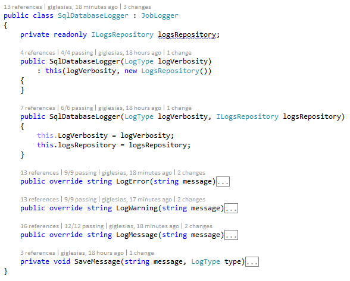
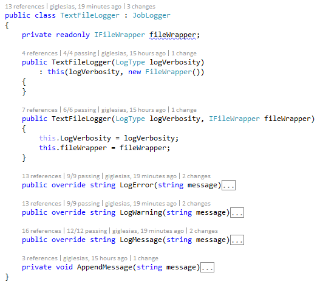

# Feedback and findings for Code Review exercise #

This document describes all the feedback for the the provided code snippet related to logging messages to different sources.


## Compilation errors ##

The code snippet didn't compile in the first place. After adding the **JobLogger.cs** class as-is in a new C# Console application, the following errors were encountered:


The **LogMessage** method cannot receive two parameters with the same name but different type. In order to fix this, we renamed the _message_ bool parameter to _shouldLogMessage_ along with the usages throughout the method. To keep this convention, we also renamed both the _warning_ and _error_ bool parameters to _shouldLogWarning_ and _shouldLogError_ correspondingly. After this update, the method's contract looks as the following one:

```
public static void LogMessage(string message, bool shouldLogMessage, bool shouldLogWarning, bool shouldLogError)
```

If we compile the code again, we are still receiving compilation errors, as the _t_ and _l_ variables are not initialized before using them.


In order to quickly fix this, we initialized both variables as follows:

```
...

int t = 0;

...

string l = null;

...
```

After these changes, the code built successfully.

## Refactor ##

The code snippet includes logic to log messages to different sources and also to check if the messages should be logged or not based on the message's verbosity; but all of this is done within a single method in a single class, which makes it difficult to maintain and extend if we want to log to extra sources in a near future.
 
The proposed refactor includes creating a base class that exposes methods to log each type of message (error, warning or message) and creating different classes for each source by extending the base class. The logic to check whether a message should be logged or not will be included in the base class, as it applies for each source and each operation.

In addition, we propose creating wrappers to interact with the System.Console and System.IO.File classes to simplify the testing of the Console and Text File loggers. We also propose using Entity Framework for the SQL Database logger, as it's an already proven and working ORM that really simplifies the interaction with a SQL database compared to manually establishing the connection and executing queries, which can also lead to security issues. In this occasion, we'll use a code-first approach.

Regarding configuration, the different sources to use and the general verbosity to use thoughout the application will be provided as app settings in the App.config file.

The refactor and unit tests are included in a C# Console application [here](../code/CodeReviewExercise), and the instructions to configure it can be found [here](../README.md).

### Refactor Details ###

We created a base class named _JobLogger_ which exposes abstract methods that must be implemented by classes that inherit from it, which allows to log an error, warning or message. It also has a virtual method that has logic to check if the message is not null, empty or whitespace, and also if it should be logged or not based on the general application's verbosity within the App.config file and the message's verbosity.


Each implementation will encapsulate the logic to log these types of messages to the corresponding source. We've detected the following sources from the code snippet: console, SQL database and text file.


### Console logger ###

We created a ConsoleWrapper class to handle the specific interaction with the System.Console. This way, we can test the ConsoleLogger class by mocking this wrapper. The goal of the ConsoleWrapper is to have atomic operations against the System.Console, which can't be mocked because its a sealed class.


### SQL Database logger ###

We added the Entity Framework NuGet package to interact with the database in a code-first approach (which is a proven working ORM and also simplifies testing), and enabled Entity Framework migrations to handle changes in the model class and to coordinate data. The SQL Database logger class interacts with the database by using a LogsRepository, which makes use of the Entity Framework context.




### Text File logger ###

We took a similar approach as the one for the Console logger and created a FileWrapper class to handle the specific interaction with System.IO.File and also to simplify unit testing for the TextFileLogger class.


